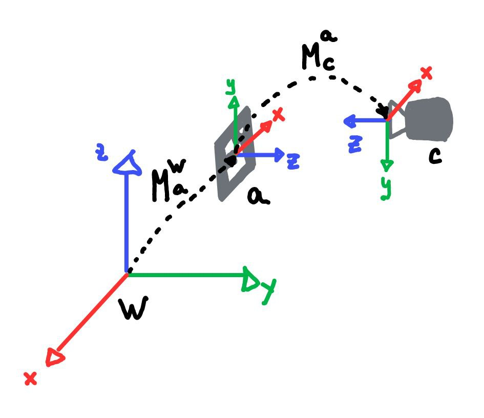

# aruco_camera_pose_estimator
    

This repo contains a ROS2 metapackage that estimates the camera pose with respect to the world frame exploiting Aruco Markers. This package implements a [ROS2 Service](https://docs.ros.org/en/humble/Tutorials/Beginner-CLI-Tools/Understanding-ROS2-Services/Understanding-ROS2-Services.html) that collects a set of $N$ measurements of the aruco position and orientation and computes the average. Then the resulting camera position and orientation is sent as the service response to the calling node. Each required parameter is loaded from a `.yaml` file.

# Installation
Install dependecies:
- [ROS2](https://docs.ros.org/en/humble/Installation.html)
- OpenCV
  ```
  sudo apt install libopencv-dev -y
  ```
- ROS CVBridge
  ```
  sudo apt-get install ros-$ROS_DISTRO-cv-bridge
  ```

The following code will build the `calibration_srv` interface and the c++ package of the program:
```
cd <path/to/your/ros2/workspace>/src
git clone https://github.com/Hydran00/aruco_camera_pose_estimator.git
cd .. 
colcon build --symlink-install
```
Then print your aruco using the 4x4 dictionary. You can use this [website](https://chev.me/arucogen/).

# Run the service server
In a sourced terminal run
```
ros2 launch aruco_camera_pose_estimator_cpp aruco_camera_pose_estimator.launch.py
```
In another sourced terminal call the service
```
ros2 service call /calibration/get_camera_pose calibration_srv/srv/Calibration "marker_id: <your-marker-id>"
```
You will get a PoseStamped message as response corresponding to the camera pose with respect to the world frame.




### Maths behind this implementation
The OpenCV Aruco Library let us compute $M_{a}^{c} \in \mathcal{R}^{4x4}$ that express the rototranslation of the Aruco with respect to the camera frame. 

Since we want $M_{c}^{w}$ (the camera with respect to the world frame), we can compute this matrix using homogeneous matrices multiplication as:

$M_{c}^{w} = M_{a}^{w}  M_{c}^{a}$  

where $M_{c}^{a} \in \mathcal{R}^{4x4}$ is the transpose of $M_{a}^{c}$ and $M_{a}^{w} \in \mathcal{R}^{4x4}$ is the rototranslation of the aruco marker with respect to the world frame.

**Note that if you just need the camera pose with respect to the aruco marker you can neglect $M_{a}^{w}$, i.e. setting it to equal to the identity matrix.**

### Parameters
#### ROS2 Parameters
  - `input_topic_name`: ROS2 input topic name of the camera image stream
  - `output_service_name`: ROS2 output service name of the computed camera pose
  - `n_observation`: the number of measurements used for the computation of the mean rototranslation (`timeout` should be set accordingly)
  - `frame_id`: the name of the world frame in which the camera pose will be expressed
  - `timeout_ms`: the amount of time in milliseconds before the data collection is considered failed. Higher `n_observation` means more time to wait for the image stream. When the timeout is reached, the service response is sent having `error` in the `frame_id` field.  
  - `show_img`: wether to show the axis of the aruco when one is found.
  - `aruco_size`: the aruco edge size in centimeters
  - `aruco_XYZ_offset_from_baseframe`: XYZ displacement of the aruco with respect to the world frame. This corresponds to the entries (0,3), (1,3), (2,3) of $M_{a}^{w}$
  `aruco_rot_offset_from_baseframe`: orientation displacement of the aruco with respect to the world frame. It is specified in (w,x,y,z) quaternion forms. This, after the conversion to the rotation matrix, corresponds to the 3x3 matrix starting from (0,0) in $M_{a}^{w}$
#### Camera calibration parameters
Camera intrinsic and distortion coefficients can be set editing `calibration_params.yaml` under `config`.

camera intrinsic:
  - `cx`
  - `cy`
  - `fx`
  - `fy`    
These parameters are the one in the calibration matrix
```math
\begin{pmatrix}
  fx & 0 & cx \\
  0 & fy & cy \\
  0 & 0 & 1 \\
\end{pmatrix}
```
distortion coefficients:
  - `k1`
  - `k2`
  - `k3`
  - `p1`
  - `p2`

**Note: The currently loaded parameters in the yaml file belongs to the RS435 @ 1920x1080.**

Each parameters can be set editing `config.yaml`

### Tips: changing aruco dictionary
If you need to use a different aruco dictionary you just need to update the following line in `image_processor.cpp`

```
dictionary_ = cv::aruco::getPredefinedDictionary(cv::aruco::<your_dictionary_name>);
```
